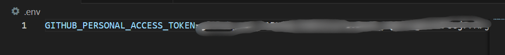
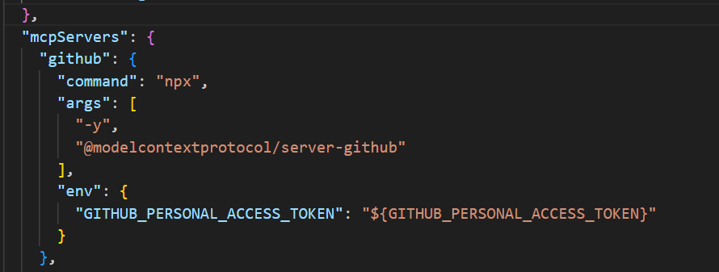
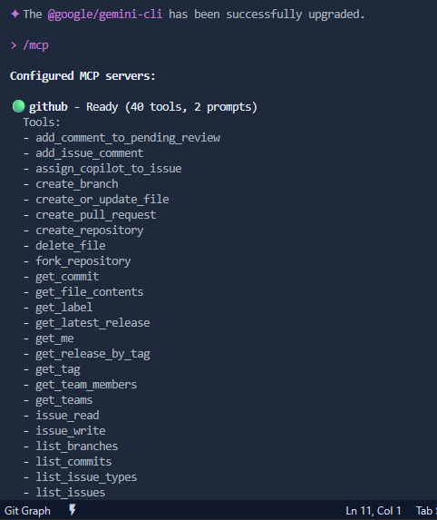
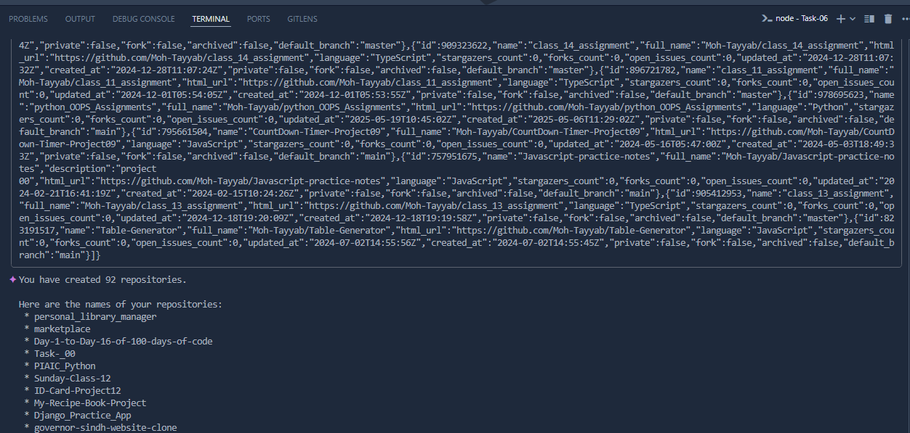

# Task-06: Step-by-Step Guide

## Step 1: Initial Setup

_This initial phase involves setting up the development environment, installing necessary dependencies, and configuring project settings. It ensures all prerequisites are met for a smooth development process, laying the groundwork for subsequent steps._

## Step 2: Configuration

_In this step, the core configurations for the project are defined and adjusted. This includes setting up API endpoints, database connections, and environment variables to tailor the application's behavior to specific requirements._

## Step 3: Process Execution

_This phase focuses on executing the main process or logic of the application. It involves running scripts, compiling code, or initiating services to perform the intended operations, transforming inputs into desired outputs._

## Step 4: Final Output

_The final step involves reviewing and presenting the generated output. This could include displaying results, generating reports, or deploying the finished product. It's crucial for verifying the success of the process and delivering the end-product._